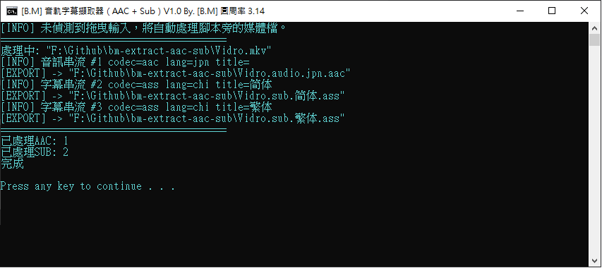

# [B.M] 音軌字幕擷取器（AAC + Sub）

[](https://www.microsoft.com/windows)
[](https://learn.microsoft.com/powershell/)
[](https://ffmpeg.org/)
[](https://github.com/BoringMan314/bm-extract-aac-sub)
[](LICENSE)

`bm-extract-aac-sub` 是一個 Windows 腳本工具，用來批次掃描影片檔並匯出：

- 所有音訊流（統一轉為 **AAC 192k**）
- 所有字幕流（依來源 codec 直接抽取，必要時自動 fallback 轉 ASS）

支援拖曳檔案／資料夾到 `.bat`，也支援 PowerShell 直接帶參數執行。

*用于批次提取视频中的音轨（转 AAC）与字幕流。*  

*動画ファイルから音声トラック（AAC）と字幕を一括抽出します。*  

*Batch-extracts audio (AAC) and subtitle streams from media files.*

> **聲明**：本專案僅為媒體檔案處理輔助工具，請確認你對來源內容具有合法使用權。

---



---

## 目錄

- [功能](#功能)
- [系統需求](#系統需求)
- [安裝方式](#安裝方式)
- [使用方式](#使用方式)
- [本機開發與測試](#本機開發與測試)
- [技術概要](#技術概要)
- [輸出命名規則](#輸出命名規則)
- [支援的檔案與字幕處理邏輯](#支援的檔案與字幕處理邏輯)
- [專案結構](#專案結構)
- [版本與多語系](#版本與多語系)
- [維護者：更新 GitHub](#維護者更新-github)
- [授權](#授權)
- [問題與建議](#問題與建議)

---

## 功能

- 針對每個媒體檔匯出全部音訊流（`-c:a aac -b:a 192k`）。
- 針對每個媒體檔匯出全部字幕流（優先 `-c copy`，失敗後自動嘗試 `-c:s ass`）。
- 可拖曳多個檔案與資料夾；資料夾會遞迴掃描。
- 若未提供輸入，會自動掃描腳本同目錄下的常見影片格式。
- 每個流輸出時都會列出 stream index、codec、language、title 方便追蹤。

---

## 系統需求

- **Windows**（建議 Windows 10/11）
- **PowerShell**
- `ffmpeg.exe` 與 `ffprobe.exe`（需與腳本放在同一資料夾；本儲存庫未附帶執行檔）
- 本專案開發與測試時使用的 `ffmpeg` / `ffprobe` 版本：**[7.1](https://github.com/GyanD/codexffmpeg/releases/download/7.1/ffmpeg-7.1-full_build.7z)**

---

## 安裝方式

1. 將以下檔案放在同一資料夾：
  - `bm-extract-aac-sub.ps1`（核心腳本，單一維護）
  - `bm-extract-aac-sub_EN.bat`
  - `bm-extract-aac-sub_TW.bat`
  - `bm-extract-aac-sub_CN.bat`
  - `bm-extract-aac-sub_JP.bat`
  - `ffmpeg.exe`
  - `ffprobe.exe`
2. 準備要處理的影片檔，或包含影片檔的資料夾。

---

## 使用方式

### 方式 A：拖曳執行（建議）

把影片檔或資料夾直接拖到任一語系啟動器（例如 `bm-extract-aac-sub_TW.bat`）。

### 方式 B：PowerShell 直接執行

```powershell
powershell -NoProfile -ExecutionPolicy Bypass -File .\bm-extract-aac-sub.ps1 -Language EN "D:\Videos\movie.mkv"
```

也可一次帶多個輸入：

```powershell
powershell -NoProfile -ExecutionPolicy Bypass -File .\bm-extract-aac-sub.ps1 -Language TW "D:\Videos\A.mkv" "D:\Videos\B.mp4" "D:\Videos\AnimeFolder"
```

若不帶任何輸入，腳本會自動掃描腳本所在資料夾中的媒體檔。

---

## 本機開發與測試

- 修改 `bm-extract-aac-sub.ps1` 後，可直接雙擊任一語系 `.bat` 驗證輸出內容。
- 若要測試指定語言，建議使用：`-Language EN/TW/CN/JP`。
- 若要避免 `pause` 停住測試流程，可先設定環境變數 `BM_NO_PAUSE=1`。

---

## 技術概要

- **批次入口** `bm-extract-aac-sub_*.bat`：負責整理拖曳參數、建立暫存清單後呼叫 PowerShell。
- **核心腳本** `bm-extract-aac-sub.ps1`：包含單一提取流程與四語系字串表。
- **媒體探測**：透過 `ffprobe` 讀取音訊/字幕 stream metadata。
- **輸出策略**：音訊固定轉 `aac 192k`；字幕優先 `copy`，失敗時 fallback 為 `ass`。

---

## 輸出命名規則

- 音訊：`<原檔名>.audio.<label>.aac`
- 字幕：`<原檔名>.sub.<label>.<ext>`

`label` 會優先使用 stream `title`，其次使用 `language`，再不行則使用 `track<index>`。  
檔名中的特殊字元會自動清理，避免 Windows 檔名衝突。

---

## 支援的檔案與字幕處理邏輯

### 自動掃描的媒體副檔名

`.mkv`, `.mp4`, `.avi`, `.mov`, `.m4v`, `.ts`, `.m2ts`, `.wmv`, `.flv`, `.webm`

### 字幕副檔名對應

- `ass` -> `.ass`
- `ssa` -> `.ssa`
- `subrip` -> `.srt`
- `webvtt` -> `.vtt`
- `mov_text` -> 轉 `.srt`
- `hdmv_pgs_subtitle` / `dvb_subtitle` -> `.sup`
- `dvd_subtitle` -> `.sub`
- 其他 codec -> 使用 codec 名稱作為副檔名（或 fallback）

---

## 專案結構


| 路徑                           | 說明                                             |
| ---------------------------- | ---------------------------------------------- |
| `bm-extract-aac-sub_*.bat`   | Windows 拖曳入口（EN/TW/CN/JP），負責整理參數後呼叫 PowerShell |
| `bm-extract-aac-sub.ps1`     | 核心流程與多語字串表（以 `-Language` 切換輸出語言）               |
| `ffmpeg.exe` / `ffprobe.exe` | 需自行取得並置於腳本同目錄；本專案測試使用版本 [`7.1`](https://github.com/GyanD/codexffmpeg/releases/download/7.1/ffmpeg-7.1-full_build.7z)                  |
| `screenshot/`                | README 展示用截圖資源（`screenshot.png`）               |
| `LICENSE`                    | MIT 授權條款                                       |
| `README.md`                  | 專案使用說明                                         |


---

## 版本與多語系

- **工具版本**：本專案測試使用的 `ffmpeg` / `ffprobe` 為 **[7.1](https://github.com/GyanD/codexffmpeg/releases/download/7.1/ffmpeg-7.1-full_build.7z)**（請自行下載並與腳本同資料夾）。
- **語言版本**：`EN`、`TW`、`CN`、`JP`（由 `-Language` 參數切換）。
- **維護模式**：僅維護單一核心腳本 `bm-extract-aac-sub.ps1`。

---

## 維護者：更新 GitHub

```powershell
git add .
git commit -m "docs: update README for bm-extract-aac-sub"
git push origin main
```

---

## 授權

本專案以 [MIT License](LICENSE) 授權。

---

## 問題與建議

若遇到抽取失敗、字幕格式不相容或命名問題，建議附上：

- 原始媒體檔資訊（可用 `ffprobe` 輸出）
- 失敗時的終端訊息
- 可重現步驟

